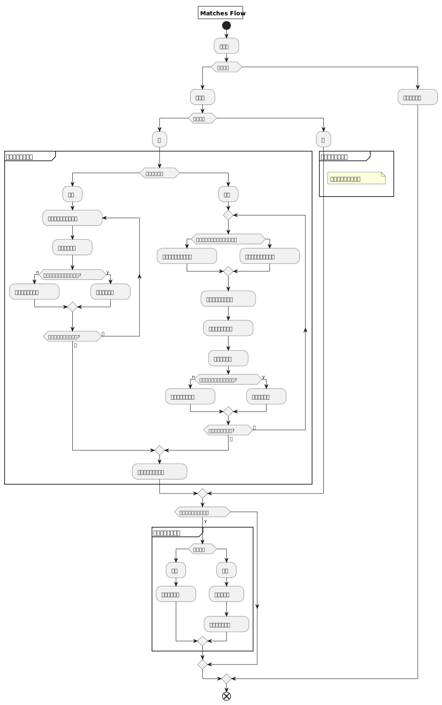

# Matches


## 快速開始
任務透過介面開始非同步處理

```
func main() {
	ctx := context.TODO()
	handle := matches.New(ctx)

	reqOrder := order.OrderInfo{
		OrderType:       uint8(rand.Intn(2) + 1),
		TransactionType: uint8(rand.Intn(2) + 1),
		OrderStartTime:  time.Now().UnixNano(),
		Quantity:        int64(rand.Intn(100)),
		Price:           float64(rand.Intn(1000)),
	}

	handle.NewOrder(&reqOrder)

    ...
}
```

## 物件

### 控制介面
提供使用者操作

```
type IMatches interface {
	NewOrder(order *order.OrderInfo) // 發起新訂單
}
```

### 搓合管理物件
管理使用者請求訊號

```
type engine struct {
	ctx        context.Context
	sellHandle *orderHandle // 賣單管理
	buyHandle  *orderHandle // 買單管理
	msgIn      chan *engineFlow
}
```

### 傳遞訊號物件
使用者操作搓合管理物件的訊號資料
通過介面操作將會自動生成

```
type engineFlow struct {
	EventCode uint8
	Order     *order.OrderInfo
}
```

### 訂單物件
搓合管理物件處理任務所需的資料

```
type OrderInfo struct {
	OrderType       OrderType
	TransactionType TransactionType
	Price           float64
	Quantity        int64
	OrderStartTime  int64
}
```


## 搓合任務活動圖

